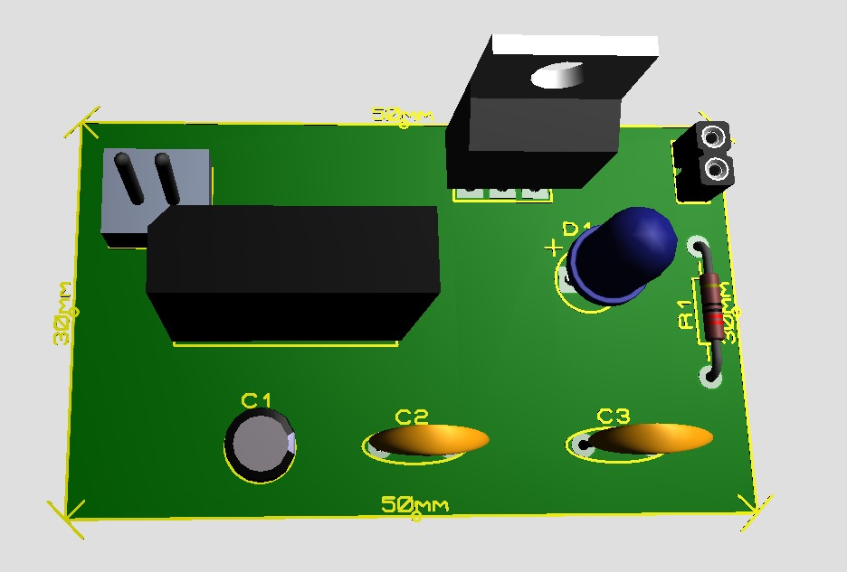

## Funcionamento do 3d ##

Esse é o modelo 3D da placa de circuito impresso (PCB) projetada para um circuito eletrônico que transforma corrente alternada em corrente contínua e fornece a energia para um led. 
A imagem mostra os componentes utilizados sobre a placa para a conversão, sendo:
- J2 (entrada da corrente alternada)
- Ponte retificadora (retificação)
- Capacitor (filtragem)
- 7805 (regulagem da tensão)
- Conector (saída regulada da tensão DC)

As medidas da placa são anotadas entre 50mm x 30mm.

### Traseira da placa ###
Demonstrando os caminhos do circuito
