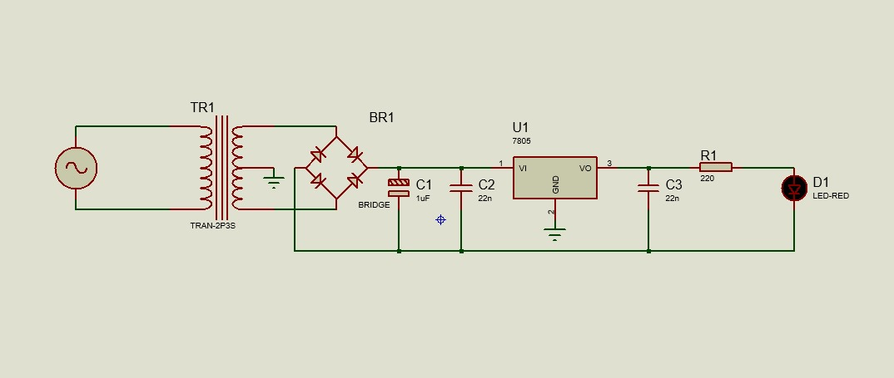

## Funcionamento da Esquemática ##

Este circuito consiste em uma fonte de alimentação regulada de 5V, projetada para converter a tensão alternada (AC) da rede elétrica em uma tensão contínua (DC) estável de 5V. Essa tensão é ideal para alimentar circuitos eletrônicos sensíveis.  
O circuito é composto por um transformador, uma ponte retificadora, capacitores de filtragem e um regulador de tensão 7805. Além disso, um LED é utilizado como indicador de funcionamento.

### 1. Fonte de tensão AC ###  
Representa a rede elétrica ou qualquer outra fonte de tensão alternada que será convertida em corrente contínua.  

### 2. Transformador ###  
Reduz a tensão da rede elétrica para um nível adequado ao circuito (por exemplo, de 220V para 12V AC).  
Além disso, proporciona isolamento elétrico, aumentando a segurança do sistema.  

### 3. Ponte Retificadora ###  
Converte a corrente alternada (AC) do transformador em corrente contínua pulsante (DC).  
É composta por quatro diodos dispostos em configuração de ponte, garantindo que a saída tenha sempre a polaridade correta.  

### 4. Capacitor de Filtragem ###  
Suaviza a tensão retificada, reduzindo a ondulação (ripple) e melhorando a estabilidade da tensão DC antes da regulação.  

### 5. Regulador de Tensão (7805) ###  
Componente responsável por ajustar a tensão de entrada (geralmente 12V DC) para uma saída estável de 5V DC.  
Possui três terminais:  
- **VI (entrada):** recebe a tensão DC não regulada;  
- **GND (terra):** referência do circuito;  
- **VO (saída):** fornece os 5V regulados.  

Esse regulador evita flutuações de tensão e protege os circuitos alimentados contra variações indesejadas.  

### 6. Capacitores de Desacoplamento ###  
Aprimoram a estabilidade do regulador de tensão, reduzindo ruídos e interferências de alta frequência.  
- O capacitor **C2** é colocado na entrada do 7805.  
- O capacitor **C3** é posicionado na saída do regulador.  

### 7. Resistor Limitador de Corrente ###  
Controla a corrente que passa pelo LED, evitando que ele queime e definindo sua intensidade luminosa.  

### 8. LED Indicador ###  
Indica o funcionamento da fonte de alimentação. Quando aceso, confirma que há uma tensão de 5V disponível na saída do circuito.  
