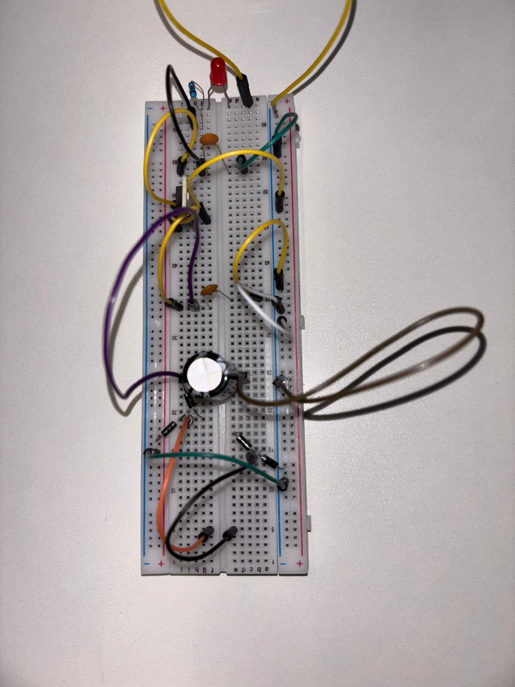

## Modelo Prático ##  

### Montagem e Procedimentos ###  

- **Montagem do Circuito:** O circuito retificador de onda foi montado em uma protoboard seguindo o esquema elétrico adequado.  
- **Conexão do Multímetro:** Um **multímetro Minipa ET-1002** foi utilizado para realizar medições nos pontos críticos do circuito.  
- **Medição da Corrente:** (Se aplicável) A corrente foi medida utilizando a função apropriada do multímetro.  
- **Registro dos Dados:** Todos os valores obtidos foram anotados para análise posterior.  

  
---

### Medição da Tensão de Saída ###  
 
- O valor medido na saída do circuito foi de **4,94V**, representando a tensão retificada e regulada pelo circuito.  
- **Análise da Forma de Onda:** (Se aplicável) Caso um osciloscópio seja utilizado, é possível observar a forma de onda da tensão de saída para uma análise mais detalhada do desempenho do retificador.  
- **Avaliação da Eficiência:** A eficiência do circuito pode ser determinada comparando as tensões de entrada e saída.  
- **Análise do Ripple:** (Se aplicável) A medição do ripple na tensão de saída permite avaliar a qualidade da retificação e a estabilidade do sinal.  

 
---

### Análise da Medição de 12V ###   

- Na imagem, o multímetro digital **Minipa ET-1002** exibe uma leitura de **9,83V**, enquanto o valor esperado seria próximo de **12V**.  
 

- Essa diferença pode ser explicada por alguns fatores, como:  
  1. **Queda ou Oscilação de Tensão** – Possíveis perdas no circuito devido à resistência dos componentes ou variações na fonte de alimentação.  

Essa análise permite identificar potenciais ajustes necessários para otimizar o desempenho do circuito.  
